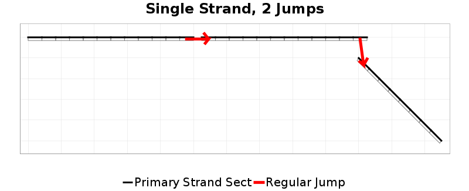
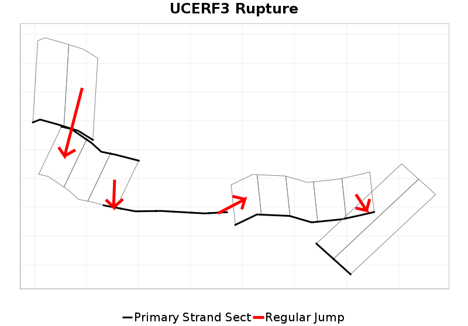
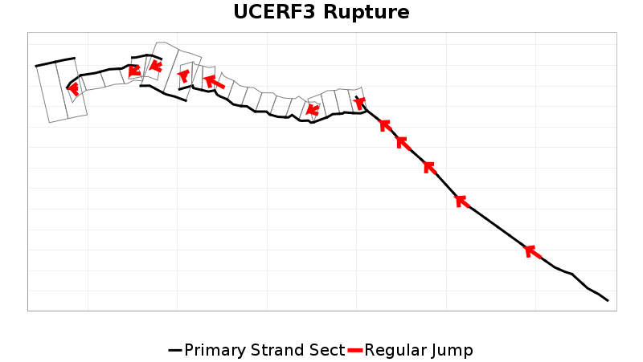
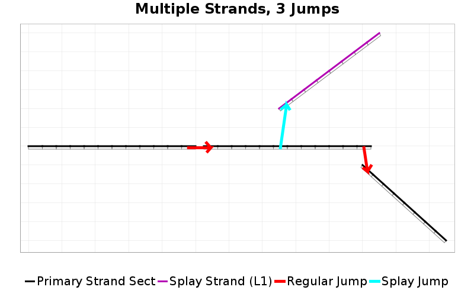
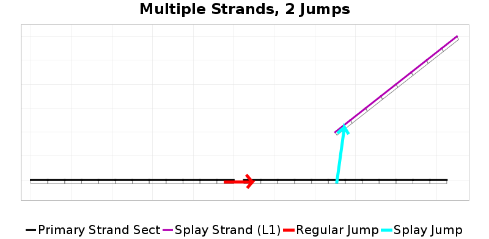
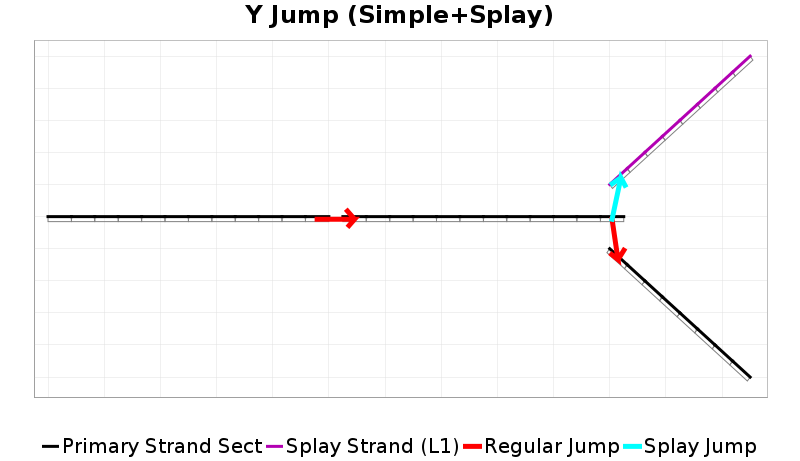
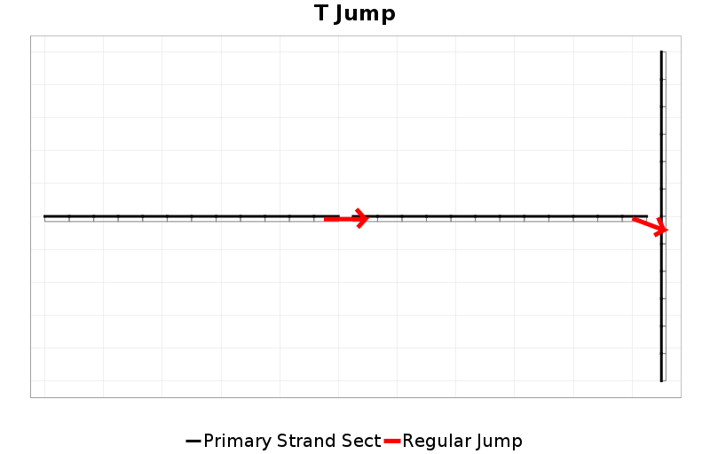
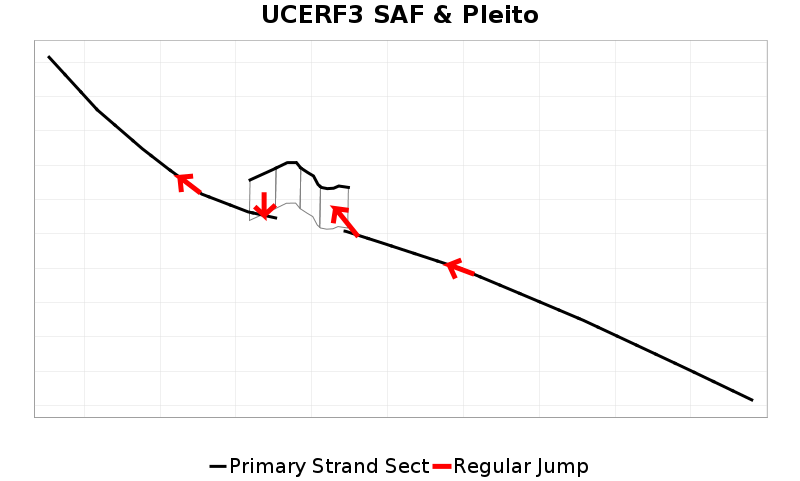
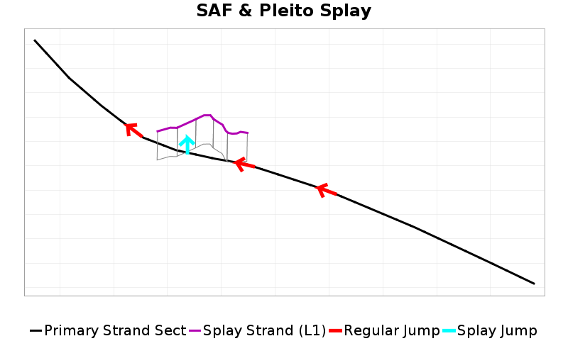

# Cluster Rupture Documentation

In UCERF3, supra-seismogenic ruptures were defined as a unique set of fault subsections. Each of those sections were connected in a single strand, with jumps allowed between parent fault sections (up to a maximum jump distance, and passing various plausibility criteria). Here is a simple cartoon involving 3 faults (with 2 jumps):

Jumps between faults are only allowed at the closest pair of subsections between each fault (the ends in this simple example). Here are a couple more complicated real UCERF3 ruptures; note that even though these ruptures are complex, you can draw a single path through the ruptures:

The code used to build UCERF3 ruptures only allowed this particular type of quasi-linear (single strand) rupture, but there are examples in nature (and many in RSQSim) of more complicated rupture behavior. I rewrote the UCERF3 rupture building code to accommodate additional complexity which is outlined below. We may decide that additional complexity is unnecessary for hazard, but I wanted to start things without locking us into the same assumptions as UCERF3.

This new rupture representation, which I call "Cluster Ruptures," allows for splays:

A splay jump occurs whenever a rupture branches into multiple strands. This also occurs whenever a jump happens in the middle of a fault section cluster, as opposed to the end (which was the only allowed jumping point in UCERF3):

It allows Y-ruptures, which are defined in this framework as a regular jump and a splay jump:

And T-ruptures (which violate UCERF3 construction rules, but don't include splays):

One of the main motivations for this new rupture representation was to be able to more accurately represent RSQSim ruptures in a UCERF-like world, and more fairly test them against UCERF3 rupture plausibility criteria. May UCERF3/RSQSim comparisons are [available here](http://opensha.usc.edu/ftp/kmilner/markdown/rsqsim-analysis/catalogs/rundir4983_stitched/multi_fault/).

Here is one example where we may want to include splay jumps in future UCERF's. Consider a SAF rupture through the Big Bend which also ruptures the Pleito fault coseismically. Here is the UCERF3 representation of that rupture (which was included in the model):

In order to include the Pleito fault, there has to be a gap in the Big Bend section of the SAF. If we allowed splays, then this rupture could be included:

## Notes on Azimuth Change Calculations

