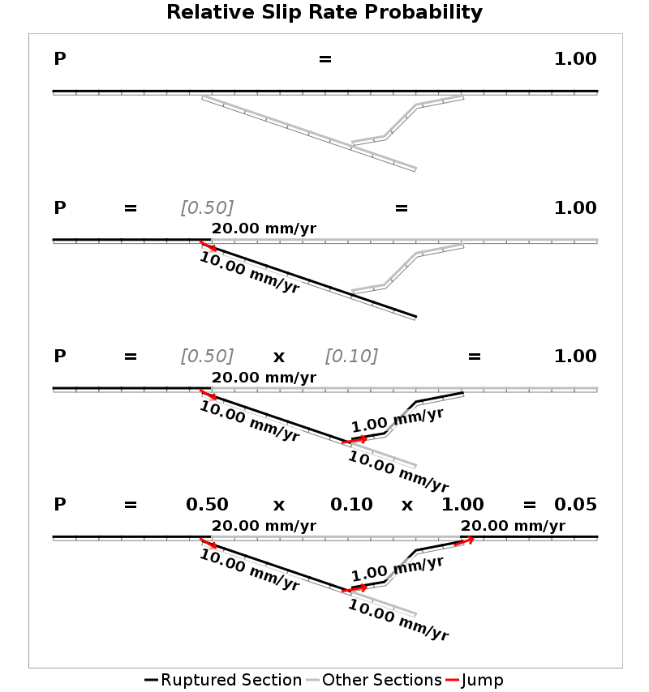
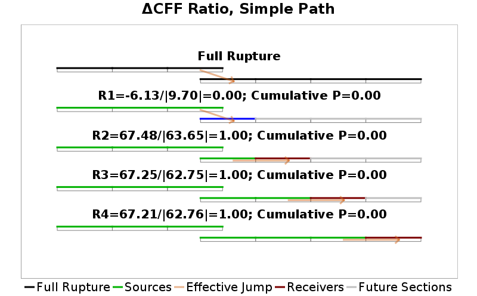
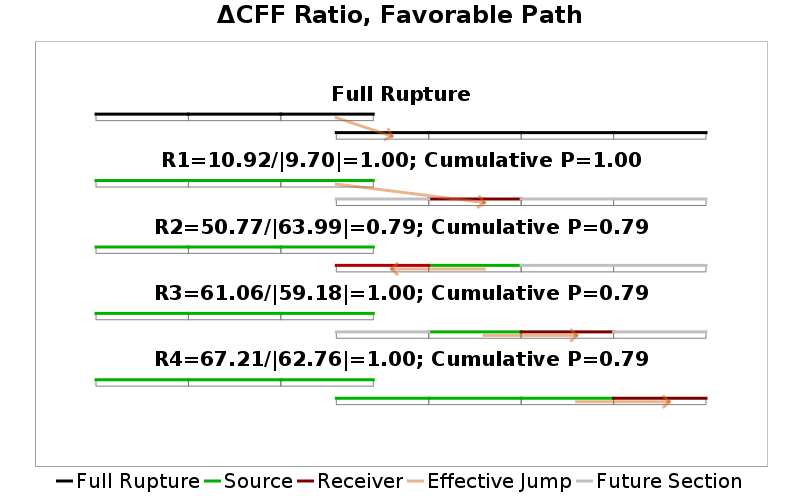
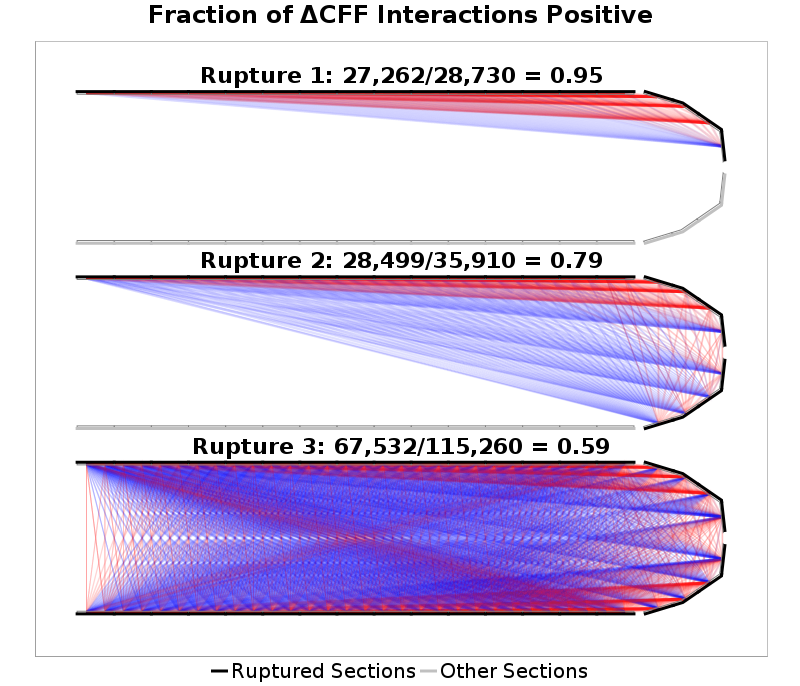
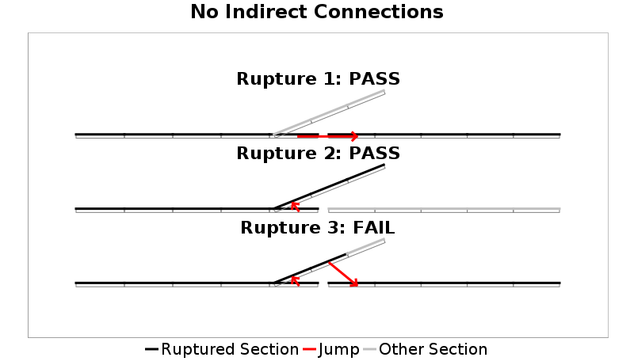

# Plausibility Filter Examples

Example figures showing new proposed plausibility filters.

## Relative Slip Rate Probability

This filter penalizes jumps taken to lower slip-rate faults when a higher slip rate alternative was available (which could be continuing on the same fault). The probability at a junction is defined as the taken slip rate divided by maximum available slip rate, and this probability is multipled through each jump taken in a rupture.

This is only applied at slip-rate increases, so ruptures can die out on low slip-rate faults without penalty; the penalty is only applied at the next slip-rate increase. This is shown by the gray probabilites that are not counted in the two middle panels of the example below.

## Relative Coulomb Probability

This filter is the same as the slip rate probability filter, but instead uses coulomb values. Negative jumps are never taken, and unlike the slip rate filter no junctions are skipped. As Coulomb calculations are not symmetric, every cluster of a rupture is tried as the nucleation cluster to see if any pass with a probability above the supplied threshold.

## Coulomb Favorability Ratio

This filter tests the Coulomb favorability of each jump taken in a rupture. First, every subsection in a rupture thus far is used as a source to compute Coulomb stress change on the candidate receiver subsection. Those are then sorted in decreasing order, and normalized by the contribution from the largest two source subsections:

`R = Sum[CFF_1...CFF_N]/|CFF_1+CFF_2|`

That ratio is bounded in the range [0,1] and treated as a probability, and multiplied out as each subsection is added to a rupture. Coulomb sums are dominated by the nearest intaraction, so the normalization by the top two penalizes additions that are largely favorable at the jumping point but are unfavorable to the rest of the rupture. The absolute value in the denominator also ensures that the sign of the interaction is kept, so negative interactions will never be allowed.

This algorithm need not use the exact jumping point defined by the connection strategy, however. The example below shows a rupture with some stress-shadowing overlap where the closest subsection does not work as a jumping point (left), but the rupture can easily jump to the next subsection and spread bilaterally (right). This example rupture only passes if the favorable path (up to a maximum distance, usually 10km) option is enabled.

As with the Coulomb probability filter, every cluster of a rupture is tried as the nucleation cluster to see if any pass.

|  |  |
|-----|-----|

## Fraction of Coulomb Interactions Positive

This filter tests the far-field Coulomb compatibility of a rupture in order to filter out overly complicated ruptures where each addition is Coulomb positive but the entire rupture is nonsensical. Here, Coulomb stress change is computed between every patch of every subsection in a rupture (including within a subsection) and the fraction that are positive are tested against a threshold (0.75 is a common threshold). There can be many millions of interactions computed to evaluate a large rupture, and all are weighted equally for this test (only their sign is considered). The example below shows the evolution of a rupture that might slip through the other Coulomb filters (as each addition is strongly near-field compatible at jumping points), but is intuitively unphysical.

## No Indirect Connections

This filter prevents a rupture from taking a small excursion that could have been skipped on one fault and then immediately jumping back to another fault that was directly connected to the prior rupture. This case is encountered where a fault network branches. We want to be able to take both branches independently (if they pass other filters), but not both.

