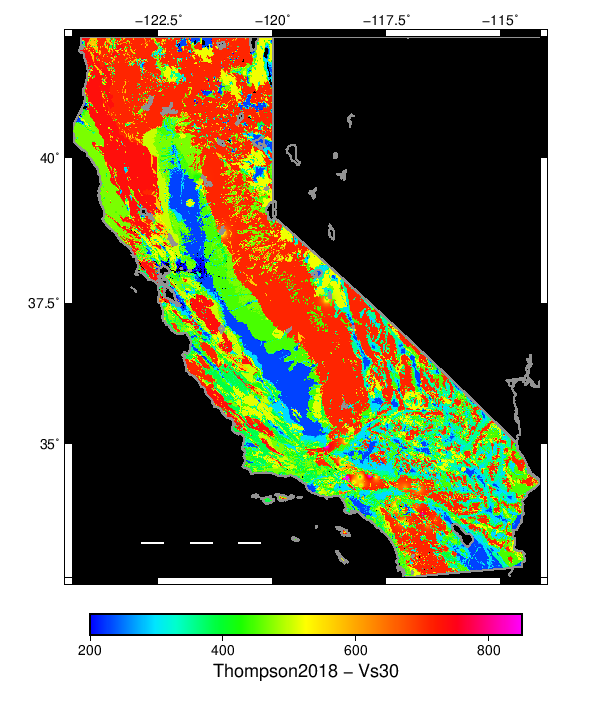
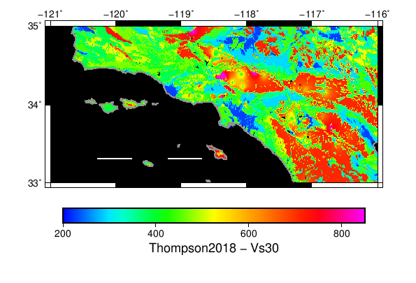

# Thompson 2018 Vs30 Data

Vs30 data from:

Thompson, E.M., 2018, An Updated Vs30 Map for California with Geologic and Topographic Constraints: U.S. Geological Survey data release, https://doi.org/10.5066/F7JQ108S.

Data converted from GeoTIFF to ESRI BIL FLT format with the `gdal_translate` linux command, GDAL 2.3.2:

```
gdal_translate -of EHdr -ot Float32 California_vs30_Wills15_hybrid_7p5c.tif California_vs30_Wills15_hybrid_7p5c.flt
```

It has a grid spacing of 0.0020833333330551648 degrees. A GZipped copy of the converted binary data is located [here](California_vs30_Wills15_hybrid_7p5c.flt.gz). The header is:

```
BYTEORDER      I
LAYOUT         BIL
NROWS          4609
NCOLS          4993
NBANDS         1
NBITS          32
BANDROWBYTES   19972
TOTALROWBYTES  19972
PIXELTYPE      FLOAT
ULXMAP         -124.500000000333
ULYMAP         42.1000000003335
XDIM           0.00208333333306629
YDIM           0.00208333333304404
NODATA         -3.4e+38
```

## Map Images & Wills (2015) Comparison

| Wills (2015) | Thompson (2018) |
| --- | --- |
|  |  |
|  |  |

