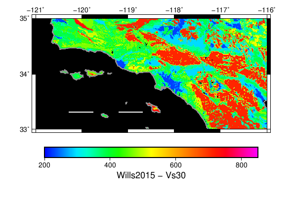

# Wills 2015 Vs30 Data

Vs30 data from:

A Next Generation VS30 Map for California Based on Geology and Topography
by C. J. Wills, C. I. Gutierrez, F. G. Perez, and D. M. Branum
Bulletin of the Seismological Society of America; December 2015; v. 105; no. 6; p. 3083-3091

The dataset contains Vs obtained from the electronic supplements, specifically `VsMapV3_20150714_shapefile.zip`, fetched 2/23/17.

Data reprojected from EPSG:3310 to EPSG:4326 with QGIS, then rasterized to the ESRI BIL float format with the `gdal_rasterize` linux command, GDAL 1.10.0. It has a grid spacing of 0.00025 degrees

The binary data is located on the SCEC opensha.usc.edu server in `/export/opensha-00/data/siteData/wills_2015`. The header is:

```
BYTEORDER      I
LAYOUT         BIL
NROWS          37900
NCOLS          41104
NBANDS         1
NBITS          32
BANDROWBYTES   164416
TOTALROWBYTES  164416
PIXELTYPE      FLOAT
ULXMAP         -124.406528862058
ULYMAP         42.0090923024621
XDIM           0.00025
YDIM           0.00025
```

## Map Images



